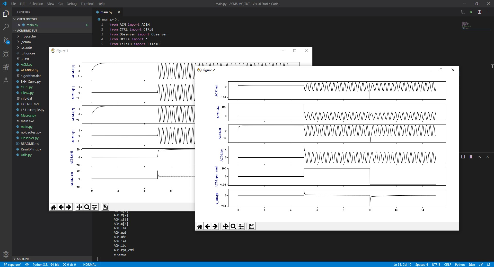

# AC Induction Motor Simulation in Python



## Introduction
This project aims to simulate <a href="https://en.wikipedia.org/wiki/Induction_motor">AC induction motor</a> in Python.

* Forked from https://github.com/horychen/ACMSIMC_TUT

* Thanks to <a href="https://horychen.github.io/about/">Jiahao Chen | 陈嘉豪</a>

* GPL-3.0 licensed

* Code structure
   * **Main Loop**
      * **Main** : Simulation Main Loop
      * **ACM** : AC Induction Motor Class
      * **CTRL** : Controller Class
      * **Observer** : Observer Class
      * **Utils** : All Utils imports and constants
      * **FileIO** : File Input and Output class
      * **Macros** : All lambda functions
      * **ACMPlot** : Draw Treand plot
   * **Addition Files**
      * **B-H_Cruve** : Draw B-H curve from 33.txt
      * **LZ4-example** : Test LZ4 and Zstandard performance
      * **ResultPrint** : Print result table in tabulate

* 6th-Derv-Of-Position (for motion control)
   * reference 1:<a href="https://www.drdobbs.com/forward-difference-calculation-of-bezier/184403417"> Forward differnece 
   calculation of bezier </a>
   * reference 2:<a href="https://github.com/synthetos/TinyG/blob/master/firmware/tinyg/plan_exec.c"> Affordable Industrial Grade Motion Control https://github.com/synthetos/TinyG/wiki </a>
   * Smooth Jerk give a smooth motion control which usually used by elevator 
   , servo controlllers , Robots ,.etc. (2nd Picture shown above , first line plot is **Speed Reference** , second one is **Speed Measurement**)

* Prerequisites
   * Python V3.8.1
   * <a href="./requirements">Requirements</a>

* HOWTO
   * Open your favourite Terminal/Shell 
   * Change work path to a directory you like
   * Run code below line-by-line
      ```Shell
      mkdir ACMSIM
      cd ACMSIM
      git clone https://github.com/tinyko/_TINY_ACMSIMC.git .
      python main.py
      ```
   *  Wait for seconds until **algorithm.dat** and **info.dat** file are generated
   *  Then matplotlib.pyplot is shown figures

## Development plans

* Visualized Configuration of AC Induction Motor
   * Stator and rotor Laminations Design
   * Coil Winding Calculations
   * Skewed Rotor bar
   * Materials Difference
   * Losses
      * Mechanical Losses
      * Iron Losses 
      * Copper Losses 
      * Wind friction Losses
   * Deep bar effects , Skin effect and the Eddy currents
* GUI in PyQT5 with Trend Viewer , Plots Evaluating ,.etc 
* Full No Load Test and More Detailed Motor Model
* Control Schemes
   * V/F Scalar Control
   * Vector Control
      * DTC(Direct Torque Control)
         * DSC(Direct Self-control)
         * SVM(Space Vector Modulation)
      * FOC(Field Oriented Cowntrol)
         * Direct FOC
         * Indirect FOC
   * Sensorless Control
   * Magnetic-field Weakening
   * (Un)Coiler tension control 
   * Two-mass drives issue 
   * Ramp
      * Linear Reference
      * S-curve
      * ~~6th-Derivative-of-Position~~
* Stable And Transient Motor Model Analysis
* AC-AC(DC-AC) converter Topology
   * Converter with DC-link
      * (regenerative) voltage-source
      * current-source
   * Matrix Converter
      * the Direct Matrix
      * the indirect matrix
   * Hybrid Matrix

## Develop Notes (Tiny 2020.02.16)
TO DO List
1) ~~Separate Programm Functions into different python modules~~
2) GUI in PyQT5 (~~Auto Scale GUI, QT GUI layout~~)
3) Async communications between Real-time and GUI module
4) Design a python to c source translator(like simulink) (further plan)
5) ~~motor topology~~
6) Add json config file to manage parameters
7) create a **Trend Viewer** to evaluate trends data , which could have some functions to calculate,zoom in/out,.etc(like IBA©analyzer)
8) Save all **critical** data in trends
9) Create ~~a speical~~ **HDF5** data file structure to contain data informations(timebase,timestamp,.etc) and values(bool,string,int,float,.etc)
10) Remove all **redundant** code and cross-reference
11) Separate ODE-solver to a single module , Current Method is Runge-Kutta 5th order Method
      * Methods
         * Implicit(Explicit) Runge-Kutta Methods
         * Adams–Bashforth methods
         * Adams–Moulton methods
         * Gear's Backward differentiation formulas (BDF)
         * Euler Forawrd/Backward Method
         * Kaps-Rentrop Methods / Rosenbrock methods
         * Gauss-Jackson Method
         * Predictor-Corrector Methods
         * Relaxation Methods
      * Issues
         * Stiff problems
         * Stability and convergence
12) Decoupling sub-modules

Done List
1) ~~Converted C program into Python Single File "Alter"~~
2) ~~Modified ACMPlot as a library to Main Python Script~~
3) ~~Compared LZ4 and Zstandard (Winner is LZ4! In Realtime scenanio)~~
4) ~~numpy ndarray could be converted into bytes , vice versa~~
6) ~~Add a 6th-order speed ref curve~~
